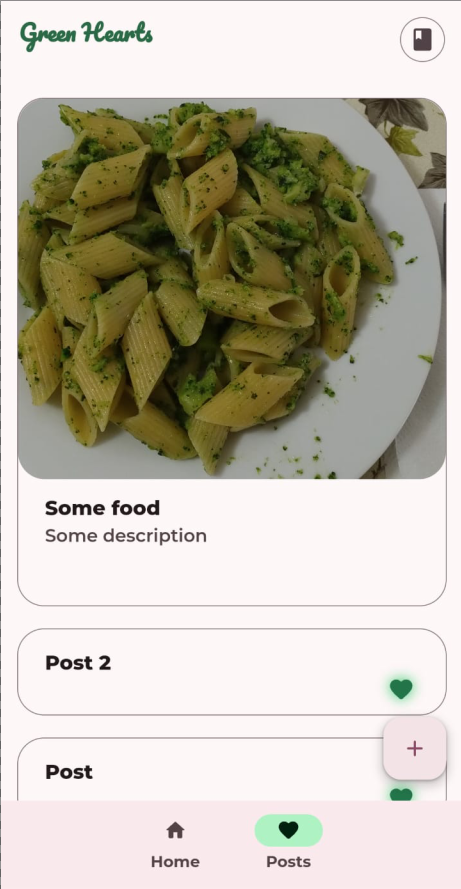
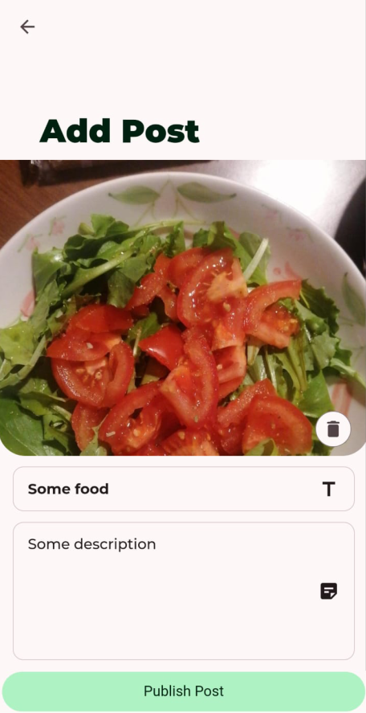

# Green Hearts


Green Hearts is a mobile application designed for users who are struggling to
lose weight. It offers a comfy environment where they can track their
progress, receive helpful advice, and monitor their stats.

I initially developed this project for my girlfriend, and after achieving very
positive results, I decided to make it widely available with the eventual goal of
publishing it on major mobile app stores.

## How it works

Users can post food or workout entries and receive a score. These scores are
represented as colored "hearts," each with a unique positive or negative value.
The score, along with comments, can be:

1. Generated by a fine-tuned LLM model (default option).

2. Provided by a real-life nutritionist, who can install the application and monitor multiple patients.

Additional features include menu suggestions (which can either be autogenerated
or proposed by a real-life nutritionist), predicted weight trajectories, and
achievement tracking.

---
|  |  |  |
|---------------------------------------------------|---------------------------------------------------|---------------------------------------------------------|
| Home Screen                                       | Posts Screen                                      | Adding Post Screen                                      |
---

## Developing

Currently, only Android is supported due to custom native modules not yet being
fully implemented for iOS and Web.

This project relies on Firebase, so you'll need the [Firebase
CLI](https://github.com/firebase/firebase-tools) along with the Storage, Functions and
[Firestore emulators](https://firebase.google.com/docs/emulator-suite).

> [!TIP]
> Remember to setup the required envirorment variables in an .env file like this one:
>
> ```sh
> EXPO_PUBLIC_FIRESTORE_EMULATOR_HOST=192.168.1.100
> EXPO_PUBLIC_FIRESTORE_EMULATOR_PORT=8080
> EXPO_PUBLIC_STORAGE_EMULATOR_HOST=192.168.1.100
> EXPO_PUBLIC_STORAGE_EMULATOR_PORT=9199
> EXPO_PUBLIC_AUTH_EMULATOR_HOST=192.168.1.100
> EXPO_PUBLIC_AUTH_EMULATOR_PORT=9099
> ```

### Developing Build Options

You have two main options for obtaining the required development build:

1. Using [EAS CLI](https://github.com/expo/eas-cli):
   Run the following command:

   ```sh
   eas build -p android --profile development --local

   ```

2. Manual Build with Android Studio:
   Run the following command:

   ```sh
   bunx expo prebuild --platform android
   ```

   Then, open the `android` folder in Android Studio and build the APK from there.

### Starting Development Servers

Once you've installed the dev build APK on your device, you can start the development servers:

```sh
bun run firebase-emulators
bunx expo
```

## Contribuiting

Contributions are welcome! If you'd like to contribute, please fork the
repository, make your changes, and submit a pull request. For major changes,
consider opening an issue first to discuss your ideas.

Thank you for helping improve the project!
